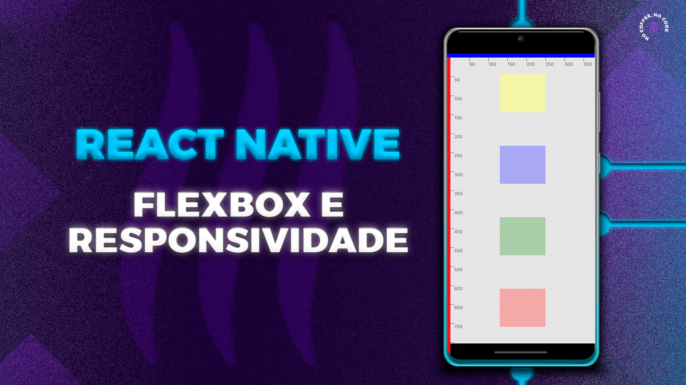

<h2>Aprenda FLEXBOX no REACT NATIVE 
</h2>

 

Este projeto foi construído para o vídeo [FLEXBOX e RESPONSIVIDADE no REACT NATIVE (Tutorial)](https://youtu.be/lwAi4PhoPkk) em nosso canal no YouTube.

### Nesse vídeo você aprenderá para que serve e quando usar as seguintes propriedades:

- flex
- flexDirection
- justifyContent
- alignItems
- alignSelf
- flexWrap
- alignContent
- flexBasis
- flexGrow
- flexShrink.

### ✅ VOCÊ TAMBÉM VAI GOSTAR DESSES VÍDEOS:

▸ [FlatList no React Native da forma CORRETA (Tutorial)](https://youtu.be/I3zD1ZVImrg)

▸ [React Navigation 6 | Drawer Navigator e TypeScript (Tutorial)](https://youtu.be/w6oHLMjeoec)

▸ [Playlist React Native](https://www.youtube.com/playlist?list=PLn1L40VzKSVKPR3ny_--s8tFbGyMdTq38)

## Redes Sociais:

- Instagram: @coffstack https://www.instagram.com/coffstack/
- TikTok: @coffstack https://www.tiktok.com/@coffstack
- Twitter: @coffstack https://twitter.com/coffstack
- Blog/Artigos: https://blog.coffstack.com/
- Instagram: @lucasgar6 https://www.instagram.com/lucasgar6/
